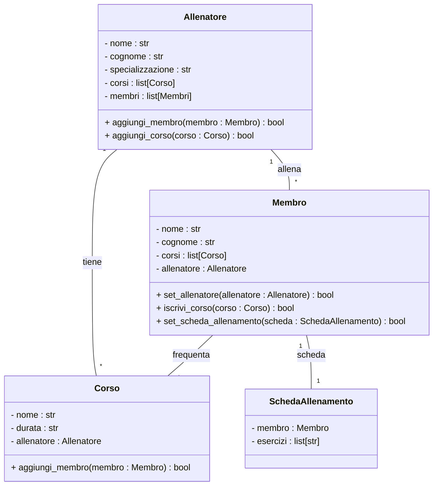

```mermaid
classDiagram

	class Allenatore {
		- nome : str
		- cognome : str
		- specializzazione : str
		- corsi : list[Corso]
		- membri : list[Membri]

		+ aggiungi_membro(membro : Membro) bool 
		+ aggiungi_corso(corso : Corso) bool
	}

	class Membro {
		- nome : str
		- cognome : str
		- corsi : list[Corso]
		- allenatore : Allenatore

		+ set_allenatore(allenatore : Allenatore) bool
		+ iscrivi_corso(corso : Corso) bool
		+ set_scheda_allenamento(scheda : SchedaAllenamento) bool
	}

	class Corso {
		- nome : str
		- durata : str
		- allenatore : Allenatore

		+ aggiungi_membro(membro : Membro) bool
	}

	class SchedaAllenamento {
		- membro : Membro
		- esercizi : list[str]
	}

	Allenatore "1" -- "*" Membro : allena
	Allenatore "1" -- "*" Corso : tiene
	Membro "*" -- "*" Corso : frequenta
	Membro "1" -- "1" SchedaAllenamento : scheda

```