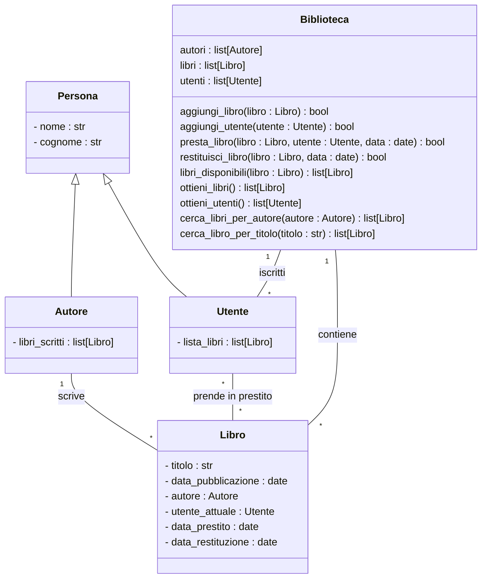

```mermaid
classDiagram

	class Biblioteca {
		autori : list[Autore]
		libri : list[Libro]
		utenti : list[Utente]

		aggiungi_libro(libro : Libro) bool
		aggiungi_utente(utente : Utente) bool
		presta_libro(libro : Libro, utente : Utente, data : date) bool
		restituisci_libro(libro : Libro, data : date) bool
		libri_disponibili(libro : Libro) list[Libro]
		ottieni_libri() list[Libro]
		ottieni_utenti() list[Utente]
		cerca_libri_per_autore(autore : Autore) list[Libro]
		cerca_libro_per_titolo(titolo : str) list[Libro]
	}

	class Persona {
		- nome : str
		- cognome : str
	}

	class Utente {
		- lista_libri : list[Libro]
	}

	class Libro {
		- titolo : str
		- data_pubblicazione : date
		- autore : Autore
		- utente_attuale : Utente
		- data_prestito : date
		- data_restituzione : date
	}

	class Autore {
		- libri_scritti : list[Libro]
	}

	Autore "1" -- "*" Libro : scrive
	Utente "*" -- "*" Libro : prende in prestito

	Persona <|-- Utente
	Persona <|-- Autore


	Biblioteca "1" -- "*" Libro : contiene
	Biblioteca "1" -- "*" Utente : iscritti


```
