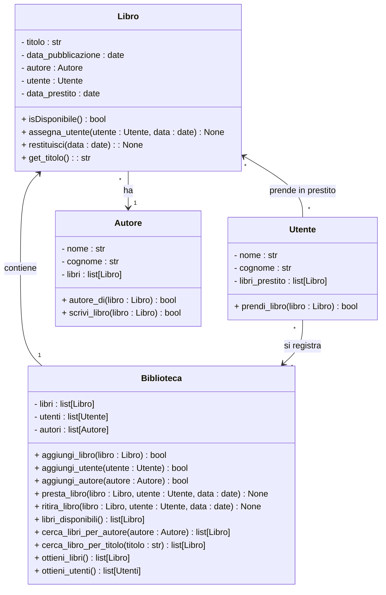

```mermaid
classDiagram
	class Libro {
		- titolo : str
		- data_pubblicazione : date
		- autore : Autore
		- utente : Utente
		- data_prestito : date
		+ isDisponibile() bool
		+ assegna_utente(utente : Utente, data : date) None
		+ restituisci(data : date) : None
		+ get_titolo() : str
	}

	class Utente {
		- nome : str
		- cognome : str
		- libri_prestito : list[Libro]
		+ prendi_libro(libro : Libro) bool
	}

	class Autore {
		- nome : str
		- cognome : str
		- libri : list[Libro]
		+ autore_di(libro : Libro) bool
		+ scrivi_libro(libro : Libro) bool
	}

	class Biblioteca {
		- libri : list[Libro]
		- utenti : list[Utente]
		- autori : list[Autore]
		+ aggiungi_libro(libro : Libro) bool
		+ aggiungi_utente(utente : Utente) bool
		+ aggiungi_autore(autore : Autore) bool
		+ presta_libro(libro : Libro, utente : Utente, data : date) None
		+ ritira_libro(libro : Libro, utente : Utente, data : date) None
		+ libri_disponibili( ) list[Libro]
		+ cerca_libri_per_autore(autore : Autore) list[Libro]
		+ cerca_libro_per_titolo(titolo : str) list[Libro]
		+ ottieni_libri() list[Libro]
		+ ottieni_utenti() list[Utenti]
	}

	Libro "*" --> "1" Autore : ha
	Libro "*" <-- "1" Biblioteca : contiene
	Utente "*" --> "1" Biblioteca : si registra
	Libro "*" <-- "*" Utente : prende in prestito
```