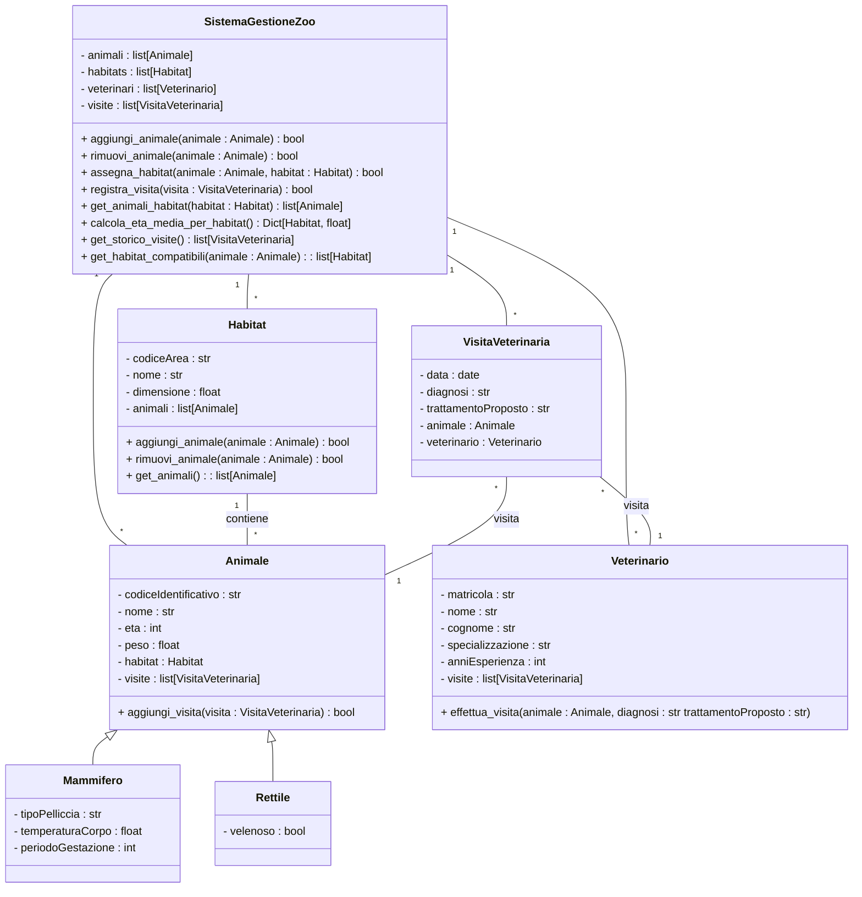

```mermaid
classDiagram

	class Animale {
		- codiceIdentificativo : str
		- nome : str
		- eta : int
		- peso : float
		- habitat : Habitat
		- visite : list[VisitaVeterinaria]
		+ aggiungi_visita(visita : VisitaVeterinaria) bool
	}
	
	class Mammifero {
		- tipoPelliccia : str
		- temperaturaCorpo : float
		- periodoGestazione : int
	}

	class Rettile {
		- velenoso : bool
	}

	class Habitat {
		- codiceArea : str
		- nome : str
		- dimensione : float
		- animali : list[Animale]

		+ aggiungi_animale(animale : Animale) bool
		+ rimuovi_animale(animale : Animale) bool
		+ get_animali() : list[Animale]
	}

	class Veterinario {
		- matricola : str
		- nome : str
		- cognome : str
		- specializzazione : str
		- anniEsperienza : int
		- visite : list[VisitaVeterinaria]

		+ effettua_visita(animale : Animale, diagnosi : str trattamentoProposto : str)
	}

	class VisitaVeterinaria {
		- data : date
		- diagnosi : str
		- trattamentoProposto : str
		- animale : Animale
		- veterinario : Veterinario
	}

	class SistemaGestioneZoo {
		- animali : list[Animale]
		- habitats : list[Habitat]
		- veterinari : list[Veterinario]
		- visite : list[VisitaVeterinaria]

		+ aggiungi_animale(animale : Animale) bool
		+ rimuovi_animale(animale : Animale) bool
		+ assegna_habitat(animale : Animale, habitat : Habitat) bool
		+ registra_visita(visita : VisitaVeterinaria) bool
		+ get_animali_habitat(habitat : Habitat) list[Animale]
		+ calcola_eta_media_per_habitat() Dict[Habitat, float]
		+ get_storico_visite() list[VisitaVeterinaria]
		+ get_habitat_compatibili(animale : Animale) : list[Habitat]
	}
	
	SistemaGestioneZoo "1" -- "*" Habitat
	SistemaGestioneZoo "1" -- "*" VisitaVeterinaria
	SistemaGestioneZoo "1" -- "*" Veterinario
	SistemaGestioneZoo "1" -- "*" Animale

	Animale <|-- Mammifero
	Animale <|-- Rettile
	Habitat "1" -- "*" Animale : contiene
	VisitaVeterinaria "*" -- "1" Animale : visita
	VisitaVeterinaria "*" -- "1" Veterinario : visita

```
