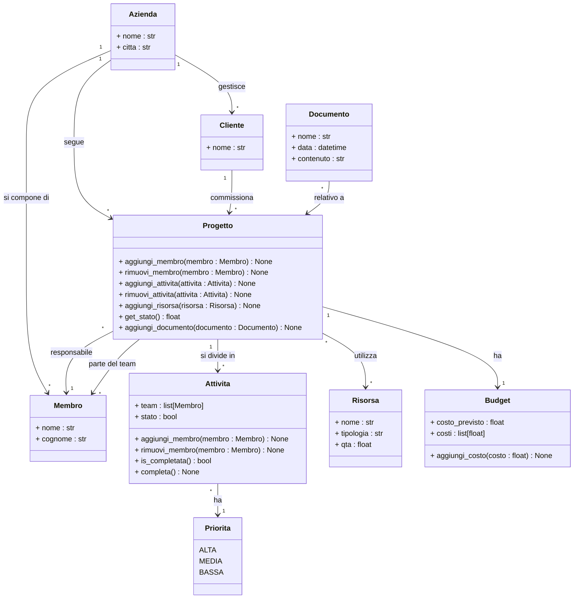

```mermaid
classDiagram
	class Azienda {
		+ nome : str
		+ citta : str
	}
	
	class Progetto {
		+ aggiungi_membro(membro : Membro) None
		+ rimuovi_membro(membro : Membro) None
		+ aggiungi_attivita(attivita : Attivita) None
		+ rimuovi_attivita(attivita : Attivita) None
		+ aggiungi_risorsa(risorsa : Risorsa) None
		+ get_stato () float
		+ aggiungi_documento(documento : Documento) None
	}
	
	class Membro {
		+ nome : str
		+ cognome : str
	}
	
	class Cliente {
		+ nome : str
	}
	
	class Documento {
		+ nome : str
		+ data : datetime
		+ contenuto : str
	}

	class Attivita {
		+ team : list[Membro]
		+ stato : bool
		+ aggiungi_membro(membro : Membro) None
		+ rimuovi_membro(membro : Membro) None
		+ is_completata() bool
		+ completa() None
	}

	class Priorita {
		ALTA
		MEDIA
		BASSA
	}

	class Risorsa {
		+ nome : str
		+ tipologia : str
		+ qta : float
	}

	class Budget {
		+ costo_previsto : float
		+ costi : list[float]
		+ aggiungi_costo(costo : float) None
	}

	Azienda "1" --> "*" Progetto : segue
	Azienda "1" --> "*" Membro : si compone di
	Azienda "1" --> "*" Cliente : gestisce
	Cliente "1" --> "*" Progetto : commissiona
	Progetto "1" --> "*" Attivita : si divide in
	Progetto "*" --> "1" Membro : responsabile
	Progetto "*" --> "*" Membro : parte del team
	Progetto "1" --> "1" Budget : ha
	Progetto "*" --> "*" Risorsa : utilizza
	Attivita "*" --> "1" Priorita : ha
	Documento "*" --> "1" Progetto : relativo a


```