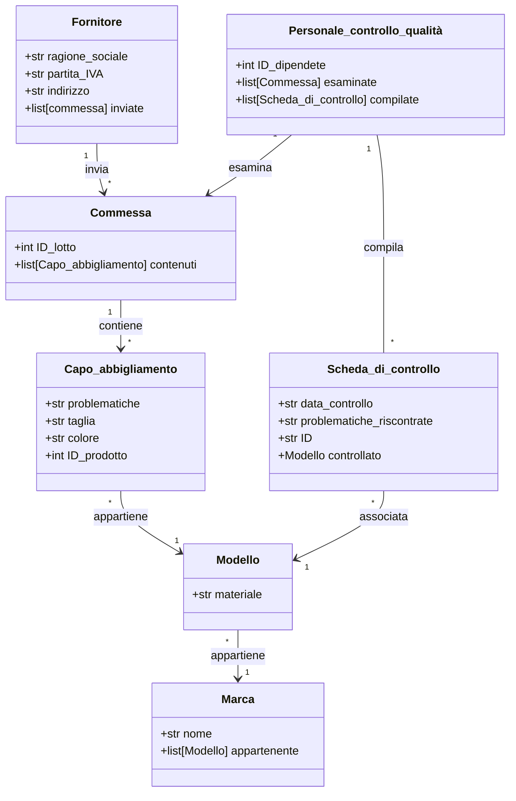

```mermaid
classDiagram

	class Fornitore {
		+str ragione_sociale
		+str partita_IVA
		+str indirizzo
		+list[commessa] inviate
	}

	class Commessa {
		+int ID_lotto
		+list[Capo_abbigliamento] contenuti
	}

	class Capo_abbigliamento {
		+str problematiche
		+str taglia
		+str colore
		+int ID_prodotto
	}

	class Modello{
		+str materiale
	}

	class Marca{
		+str nome
		+list[Modello] appartenente
	}

	class Personale_controllo_qualità {
		+int ID_dipendete
		+list[Commessa] esaminate
		+list[Scheda_di_controllo] compilate	
	}

	class Scheda_di_controllo {
		+str data_controllo
		+str problematiche_riscontrate
		+str ID
		+Modello controllato
	}

	Fornitore "1" --> "*" Commessa : invia
	Commessa "1" --> "*" Capo_abbigliamento : contiene
	Capo_abbigliamento "*" --> "1" Modello : appartiene
	Personale_controllo_qualità "1" -- "*" Scheda_di_controllo : compila
	Scheda_di_controllo "*" --> "1" Modello : associata
	Personale_controllo_qualità "1" --> "*" Commessa : esamina
	Modello "*" --> "1" Marca : appartiene
```