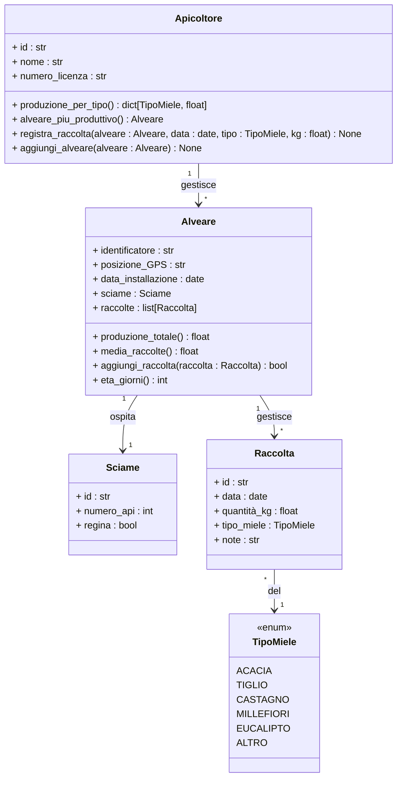

```mermaid
classDiagram
	class TipoMiele {
		<<enum>>
		ACACIA
		TIGLIO
		CASTAGNO
		MILLEFIORI
		EUCALIPTO
		ALTRO
	}

	class Apicoltore {
		+ id : str
		+ nome : str
		+ numero_licenza : str
		+ produzione_per_tipo() dict[TipoMiele, float]
		+ alveare_piu_produttivo() Alveare
		+ registra_raccolta(alveare : Alveare, data : date, tipo : TipoMiele, kg : float) None
		+ aggiungi_alveare(alveare : Alveare) None
	}

	class Alveare {
		+ identificatore : str
		+ posizione_GPS : str
		+ data_installazione : date
		+ sciame : Sciame
		+ raccolte : list[Raccolta]
		+ produzione_totale() float
		+ media_raccolte() float
		+ aggiungi_raccolta(raccolta : Raccolta) bool
		+ eta_giorni() int
	}

	class Sciame {
		+ id : str
		+ numero_api : int
		+ regina : bool
	}

	class Raccolta {
		+ id : str
		+ data : date
		+ quantità_kg : float
		+ tipo_miele : TipoMiele
		+ note : str
	}

	Apicoltore "1" --> "*" Alveare : gestisce
	Alveare "1" --> "1" Sciame : ospita
	Alveare "1" --> "*" Raccolta : gestisce
	Raccolta "*" --> "1" TipoMiele : del

```