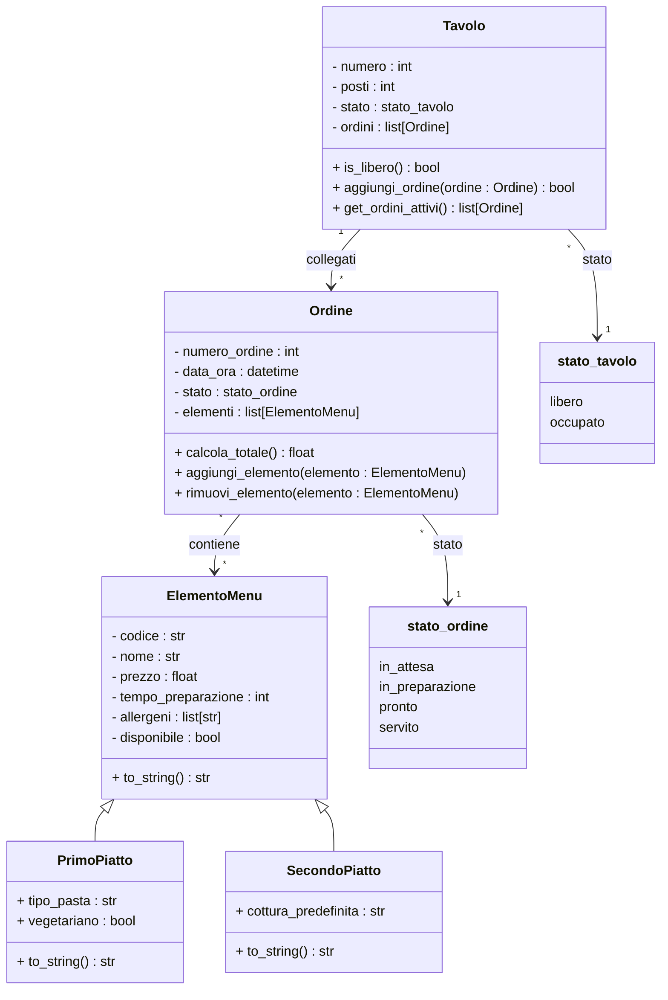

```mermaid
classDiagram

	class ElementoMenu {
		- codice : str
		- nome : str
		- prezzo : float
		- tempo_preparazione : int
		- allergeni : list[str]
		- disponibile : bool
		+ to_string() str
	}

	class PrimoPiatto {
		+ tipo_pasta : str
		+ vegetariano : bool
		+ to_string() str
	}
	
	class SecondoPiatto {
		+ cottura_predefinita : str
		+ to_string() str
	}

	class Ordine {
		- numero_ordine : int
		- data_ora : datetime
		- stato : stato_ordine
		- elementi : list[ElementoMenu]
		+ calcola_totale() float
		+ aggiungi_elemento(elemento : ElementoMenu)
		+ rimuovi_elemento(elemento : ElementoMenu)
	}

	class stato_ordine {
		in_attesa
		in_preparazione
		pronto
		servito
	}

	class Tavolo {
		- numero : int
		- posti : int
		- stato : stato_tavolo
		- ordini : list[Ordine]
		+ is_libero() bool
		+ aggiungi_ordine(ordine : Ordine) bool
		+ get_ordini_attivi() list[Ordine]
	}

	class stato_tavolo {
		libero
		occupato
	}

	ElementoMenu <|-- PrimoPiatto
	ElementoMenu <|-- SecondoPiatto
	Ordine "*" --> "*" ElementoMenu : contiene
	Ordine "*" --> "1" stato_ordine : stato
	Tavolo "*" --> "1" stato_tavolo : stato
	Tavolo "1" --> "*" Ordine : collegati

```